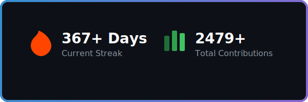

## Hi there 👋

# 💫 About Me:
I am a passionate **Data Science & ML Engineer** focused on building intelligent systems and extracting actionable insights from complex datasets. My journey involves deep-diving into AI research while contributing to the global open-source ecosystem.

- 🚀 **Currently driving**: High-impact **AI & Machine Learning** projects and contributing to the core of `scikit-learn` and `pandas`.
- 🤝 **Open to collaborate**: On technical projects requiring **Python**, **SQL**, and **Power BI** excellence.
- 💡 **Interested in**: Scaling **MLOps** pipelines and advanced **Statistical Modeling**.
- 🌱 **Learning & Growing**: Expanding my expertise in **Generative AI** and **Deep Learning**.
- 💬 **Let's talk about**: **Data Strategy**, predictive analytics, or the latest in tech!

## 🌐 Socials:
  

# 💻 Tech Stack:
                                     

# 🚀 Open Source Journey
Currently contributing to major data science libraries:
- 🛠️ **Hugging Face Datasets**: Fixed `TypeError` in `load_dataset_builder` related to keyword conflicts (#8008).
- 🐼 **Pandas**: Added regression tests for `groupby.var()` handling of Arrow-backed dtypes (#64169).
- 🧪 **Scikit-learn**: Fixed multiple documentation typos in `sklearn/_loss/loss.py` (#33297).

# 📊 Activity Milestones:

  
  

### ✍️ Random Dev Quote

---

<!-- Proudly created with GPRM ( https://gprm.itsvg.in ) -->

<!-- This commit unlocks the Pair Extraordinaire achievement! -->

<!-- Another pull request to ensure Pull Shark is triggered! -->
